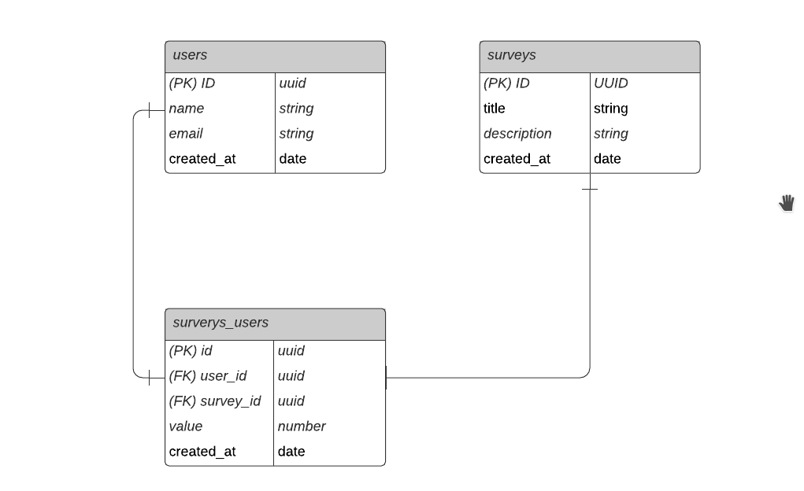

# Rocketseat Next Level Week #4

<h1 align="center">NPS-NLW</h1>

## 💻 Projeto

Projeto desenvolvido no evento "Next Level Week 4" da [Rocketseat](https://rocketseat.com.br/).

O NPS-NLW é uma aplicação que consiste em calcular o NPS da empresa. Nele fazemos o cadastro de usuários, cadastro de pesquisas, envio de e-mail para os usuários responderem as pesquisas de satisfação e com isso podemos realizar o cálculo do NPS.

Esse projeto foi desenvolvido durante a trilha de NodeJS, na quarta edição da NLW. Aprendemos conceitos sobre o que é um API, como iniciar um projeto utilizando Typescript e Express para gerenciamento das rotas, TypeORM para manipulação dos dados, testes automatizados e envio de e-mail.

## :rocket: Tecnologias

Esse projeto foi desenvolvido com as seguintes tecnologias:

- [TypeScript](https://www.typescriptlang.org/)
- [Ethereal-Email](https://ethereal.email/)
- [TypeORM](https://typeorm.io/#/)
- [Express](https://expressjs.com/pt-br/)
- [Jest](https://jestjs.io/)
- [Yup](https://github.com/jquense/yup)

## :clipboard: Diagrama



## 🔨 Como usar

Para clonar essa aplicação, você vai precisar de [Git](https://git-scm.com/), Node.js v12+ e [Yarn](https://yarnpkg.com/) instalado.

### Iniciar Aplicação

```bash
# Diretório da API
cd node/api

# Instalar dependências
yarn install

# Rodar as migrações
yarn typeorm migration:run

# Rodar testes
yarn test

# Iniciar servidor rodando na porta 3333 (http://localhost:3333)
yarn dev
```

## :memo: Licença

Esse projeto está sob a licença MIT. Veja o arquivo [LICENSE](LICENSE.md) para mais detalhes.

---

<sup>Projeto desenvolvido com a tutoria da [Daniele Leão Evangelista](https://github.com/danileao), da [Rocketseat](https://rocketseat.com.br/).</sup>
