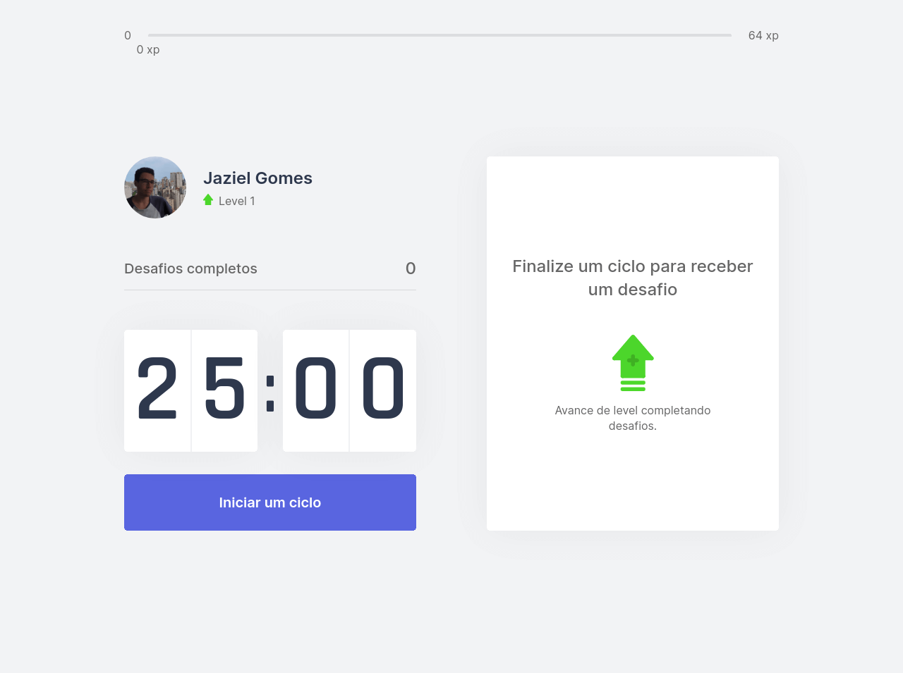
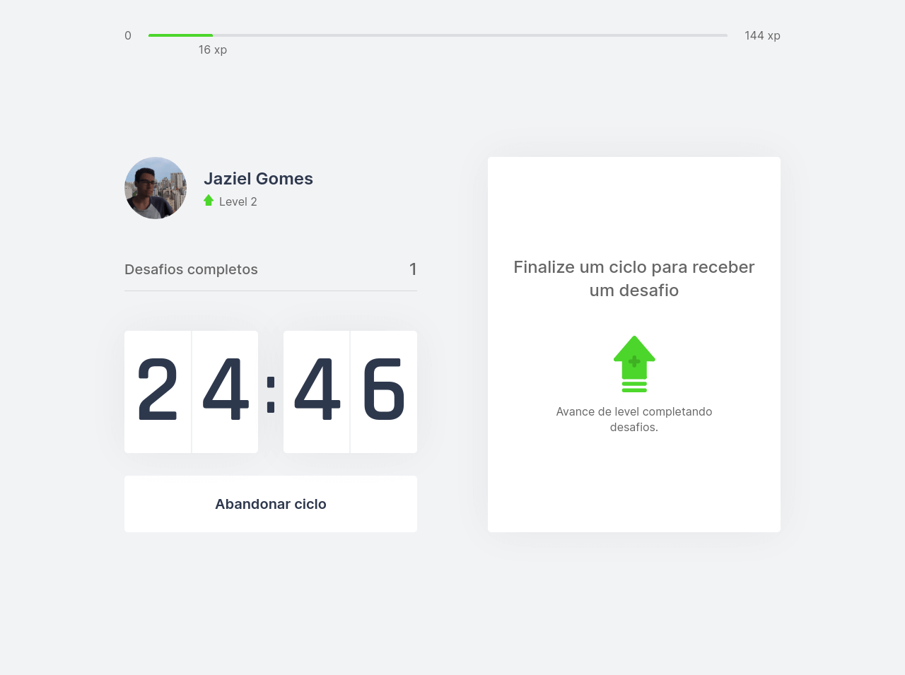
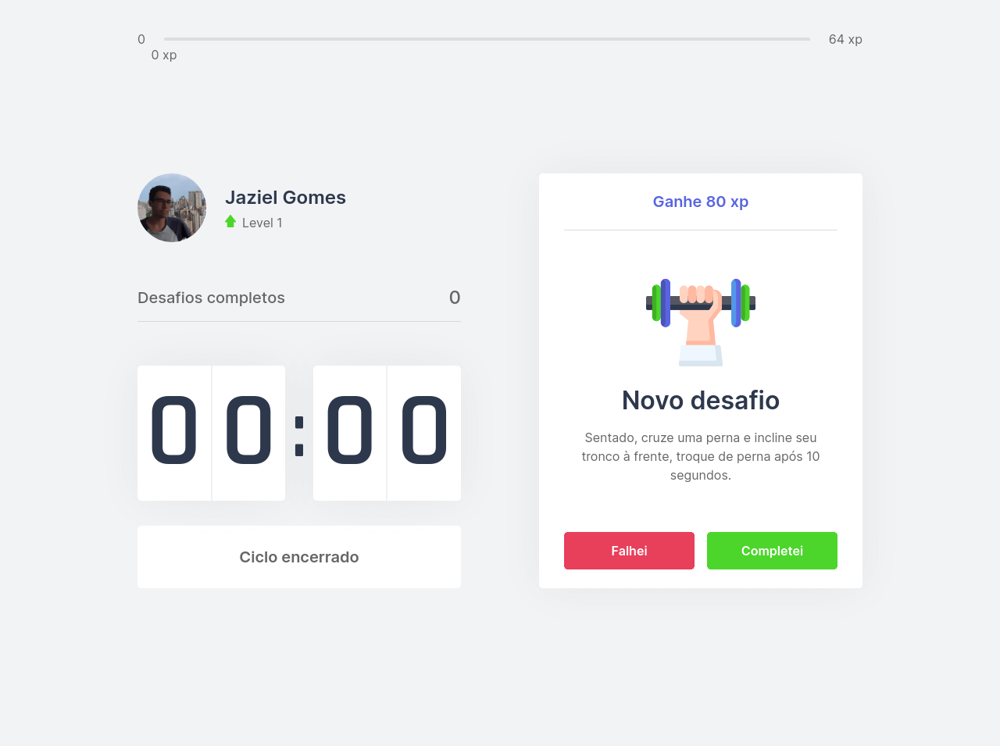

# Rocketseat Next Level Week #4

<h1 align="center">
  
</h1>

<h1 align="center">
    
    
    
    
</h1>

## 💻 Projeto

Projeto desenvolvido no evento "Next Level Week 4" da [Rocketseat](https://rocketseat.com.br/).

O move.it é um app que une a técnica de Pomodoro com a realização de exercícios físicos para quem passa muito tempo na frente do computador.

## :rocket: Tecnologias

Esse projeto foi desenvolvido com as seguintes tecnologias:

- [React](https://pt-br.reactjs.org/)
- [Next.js](https://nextjs.org/)
- [TypeScript](https://www.typescriptlang.org/)

## 🔨 Como usar

Para clonar essa aplicação, você vai precisar de [Git](https://git-scm.com/), Node.js v12+ e [Yarn](https://yarnpkg.com/) instalado.

### Iniciar Aplicação

```bash
# Diretório da API
cd moveit-next

# Instalar dependências
yarn install

# Iniciar servidor rodando na porta 3000 (http://localhost:3000)
yarn dev
```

## 🔖 Layout

Você pode visualizar o layout do projeto através [desse link](https://www.figma.com/file/ge20pu3ofMOKoliUyKx1Nl/Move.it-1.0).

## 🧠 Desafio

- Melhorar a estilização da aplicação com layout responsivo, utilização de PWA;

- Alterar as cores da aplicação, criar um tema dark.

### Desenvolver o próximo nível

`https://www.figma.com/file/qM1HJWQoVBWf3G3nz6WFl6/Move.it-2.0-(Copy)?node-id=160:2761`

## :memo: Licença

Esse projeto está sob a licença MIT. Veja o arquivo [LICENSE](LICENSE.md) para mais detalhes.

---

<sup>Projeto desenvolvido com a tutoria de [Diego Fernandes](https://github.com/diego3g), da [Rocketseat](https://rocketseat.com.br/).</sup>
